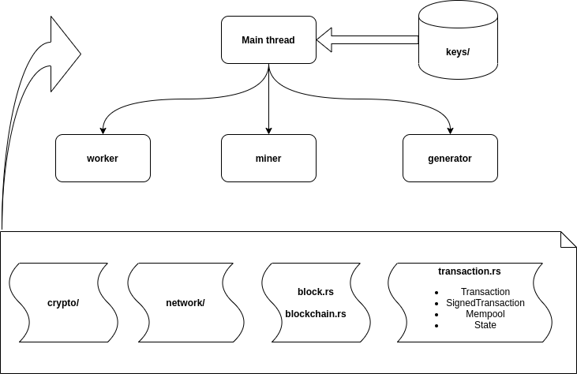

# Principles of Blockchains

This is an implementation of simplified Bitcoin client using Rust, which is a course project for ECE 598 PV: Principles of Blockchains, Spring 2020 at University of Illinois, Urbana-Champaign. [Main website of the course](https://courses.grainger.illinois.edu/ece598pv/sp2020/).

## Overview

This project builds a Bitcoin client which can mine blocks and interact with other instances through the internet and form a blockchain. Note that the client is not to run in Bitcoin mainnet or any public testnet. Instead, the goal of this project is to present and implement the distributed protocols of Bitcoin and let the users have fun playing it.

<p align="center">

</p>

As shown in the above figure, a single Bitcoin client consists of four threads each with purpose as follows:

- <strong> Main Thread </strong>: The main thread to create the client and other three threads. The client's private key is obtained from the key store, which is used for the main thread to initialize client
- <strong> Worker Thread </strong>: Worker thread handles the communication between this client and other Bitcoin clients. It is the executor of Nakamoto's Longest Chain Protocol. A synchronized blockchain can thus be maintained among distributed clients
- <strong> Generator Thread </strong>: Generator thread constantly generate transactions by sending and receiving "money" between each other. In this project, all transactions follow UTXO format.
- <strong> Miner Thread </strong>: Miner thread will put a collection of transactions into a block. Note that we assume the mining difficulty to be constant and will not change in this project.

To facilitate the execution of the four threads, we implemented some extra library functions which can be found in crypto/, network/, etc.

## Usage
In three different consoles, type the following commands:
```console
hongpeng@console1:~/bitcoin_rust$ sudo sh scripts/node1.sh
hongpeng@console2:~/bitcoin_rust$ sudo sh scripts/node2.sh
hongpeng@console3:~/bitcoin_rust$ sudo sh scripts/node3.sh
```
In the forth console, type the following commands:
```console
hongpeng@console4:~/bitcoin_rust$ sudo sh scripts/mining.sh
hongpeng@console4:~/bitcoin_rust$ sudo sh scripts/transaction.sh
```

## Example Output
<p align="center">

</p>